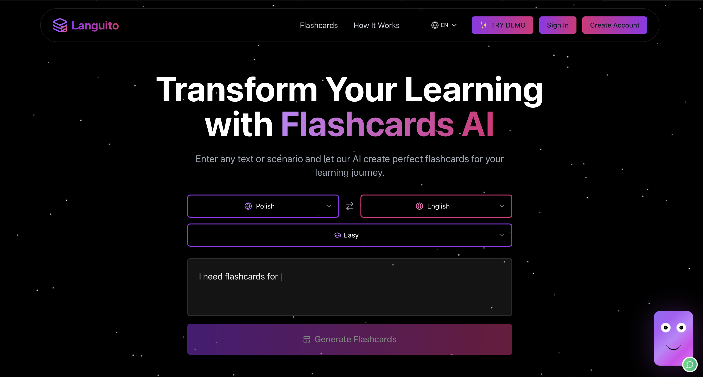
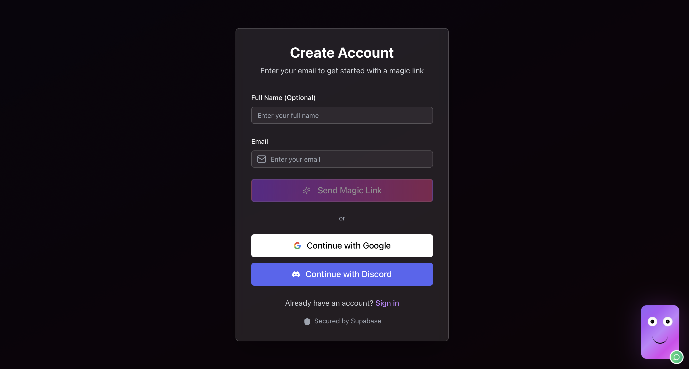
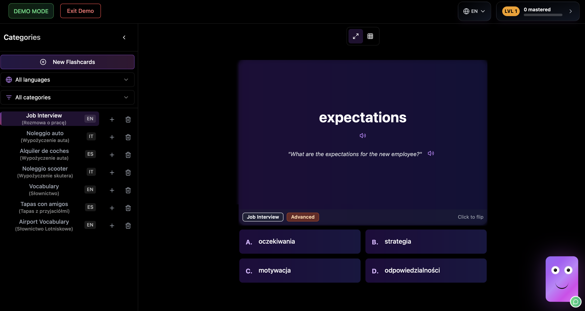
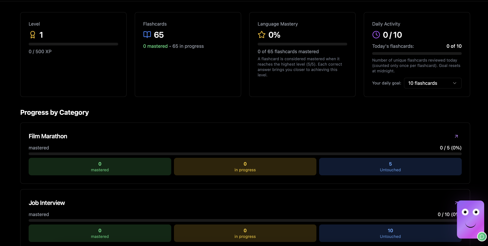

# 🧠 Next Lang AI - AI-Powered Language Learning Platform

> Intelligent flashcard generation and spaced repetition learning system with multi-language support

[](https://nextjs.org/)
[](https://www.typescriptlang.org/)
[](https://openai.com/)
[](https://supabase.com/)

## 🚀 Tech Stack

### **Frontend Framework**
- **Next.js 15.1.6** - React framework with App Router
- **React 19.0.0** - Component library with latest features
- **TypeScript 5.0** - Type safety and enhanced DX

### **AI & Backend**
- **OpenAI GPT-4** - AI-powered flashcard generation
- **Supabase** - Authentication and real-time database
- **Prisma 6.3.1** - Type-safe ORM with PostgreSQL

### **Styling & UI**
- **Tailwind CSS 3.4.1** - Utility-first CSS framework
- **Radix UI** - Accessible component primitives
- **Framer Motion 12.0.11** - Smooth animations and transitions
- **Lucide React** - Beautiful icon library

### **Internationalization**
- **Next-intl 4.1.0** - Full i18n support for 4 languages
- **Supported Languages**: English, Spanish, Italian, Polish

## 🎯 Key Features

**Language Learners → AI-Powered Solutions:**

- **AI Flashcard Generation**: Automatically create contextual flashcards from any text using OpenAI GPT-4
- **Spaced Repetition System**: Smart algorithm optimizes review timing based on mastery level (0-5 scale)
- **Multi-Language Support**: Learn any language with UI available in English, Spanish, Italian, and Polish
- **Progress Tracking**: Detailed analytics with learning streaks, daily goals, and experience points
- **Demo Mode**: Try the platform without registration
- **Responsive Design**: Seamless experience across all devices

## 🖼️ Platform Showcase

### Landing Page

*Modern hero section with AI-powered learning introduction*

### Authentication System

*Multiple auth methods: Magic Link, Discord, and Google OAuth via Supabase*

### Demo Mode & User Dashboard

*Interactive demo mode and comprehensive user dashboard with learning statistics*

### Progress Tracking

*Detailed progress visualization with mastery levels and learning streaks*

## ✨ Core Features

### **AI-Powered Learning**
- Intelligent flashcard generation using OpenAI
- Context-aware translations and examples
- Difficulty level adaptation (easy/advanced)
- Content moderation with bad-words filtering

### **Smart Progress System**
- Spaced repetition algorithm
- Mastery level tracking (0-5 scale)
- Learning streaks and daily goals
- Experience points and leveling system

### **User Experience**
- Guest mode for trying features
- Seamless flashcard import/export
- Multiple choice and typing exercises
- Audio pronunciation support

### **Database Architecture**
```sql
Users: Authentication, preferences, progress stats
Flashcards: AI-generated content with translations
Progress: Individual mastery tracking per flashcard
```

## 🏗️ Project Structure

```
next-lang-ai-app/
├── src/
│   ├── app/                    # Next.js App Router
│   │   ├── [locale]/          # Internationalized routes
│   │   ├── actions/           # Server actions
│   │   └── api/               # API routes
│   ├── components/            # React components
│   │   ├── ui/               # Reusable UI components
│   │   ├── auth/             # Authentication components
│   │   └── *.tsx             # Feature components
│   ├── core/                 # Clean Architecture
│   │   ├── entities/         # Domain models
│   │   ├── useCases/         # Business logic
│   │   └── interfaces/       # Repository contracts
│   ├── infrastructure/       # External dependencies
│   │   └── database/         # Prisma repositories
│   ├── hooks/                # Custom React hooks
│   ├── i18n/                 # Internationalization config
│   └── lib/                  # Utility functions
├── prisma/                   # Database schema & migrations
├── messages/                 # Translation files (en, es, it, pl)
└── public/                   # Static assets
```

## 🛠️ Development Setup

### Prerequisites
- Node.js 18+ 
- PostgreSQL database
- OpenAI API key
- Supabase project

### Installation

1. **Clone the repository**
   ```bash
   git clone <repository-url>
   cd next-lang-ai-app
   ```

2. **Install dependencies**
   ```bash
   npm install
   ```

3. **Environment setup**
   ```bash
   # Copy environment template
   cp .env.example .env.local
   
   # Add your API keys:
   # - DATABASE_URL (PostgreSQL)
   # - OPENAI_API_KEY
   # - SUPABASE_URL
   # - SUPABASE_ANON_KEY
   ```

4. **Database setup**
   ```bash
   npx prisma migrate dev
   npx prisma generate
   ```

5. **Start development server**
   ```bash
   npm run dev
   ```

## 🎨 Architecture Highlights

### **Clean Architecture Implementation**
- **Entities**: Core business models (Flashcard, User, Progress)
- **Use Cases**: Business logic (GenerateFlashcards, UpdateProgress)
- **Repositories**: Data access abstraction
- **Infrastructure**: External services (Prisma, OpenAI, Supabase)

### **Advanced Features**
- Server-side rendering with App Router
- Real-time progress synchronization
- AI content generation with error handling
- Comprehensive error boundaries
- Progressive Web App capabilities

## 🌐 Deployment

**Database**: PostgreSQL with Prisma migrations
**Authentication**: Supabase Auth with multiple providers
**AI Services**: OpenAI GPT-4 integration
**Hosting**: Vercel-optimized build configuration

## 📊 Learning Algorithm

The platform implements a sophisticated spaced repetition system:

- **Mastery Levels**: 0 (new) → 5 (mastered)
- **Review Intervals**: Exponentially increasing based on performance
- **Difficulty Adaptation**: AI adjusts content complexity
- **Progress Analytics**: Detailed learning insights and trends

---

**Revolutionizing language learning through AI-powered intelligent flashcard generation**

